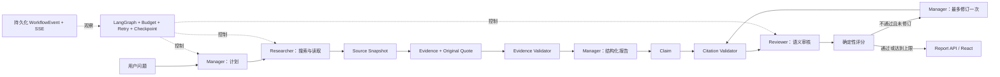

# EvidenceFlow

EvidenceFlow 是面向开发者技术选型与版本核验的**可追溯研究 Agent**。

它把一次联网调研拆成职责被代码和 Schema 固定住的三步——规划、检索取证、审核——并保证
报告里的每一句事实性结论都能回溯到**某一次真实抓取的网页原文**：

```text
Claim → Evidence ID → Source ID → Source Snapshot → Original Quote
```

最终引用 URL 不来自模型输出，只由持久化的 `SourceRecord` 渲染。模型可以写错结论，但
不能凭空造出一条引用链。

## 它解决什么问题

用大模型做技术调研，最常见的失败不是"写不出来"，而是**写得很像真的**：

- 结论看起来有引用，引用却指向不存在的页面或已被官方划掉的旧段落；
- 报告只引用支持自己的证据，对相反证据选择性忽略；
- 一次调用超时或格式瑕疵，就让整轮研究成本白费。

EvidenceFlow 针对这三点做了工程处理：证据必须来自实际抓取并落盘的快照；审核者能看到
未被引用的证据以发现选择性引用；报告侧的可修复问题（正文含链接、缺引用）被分级处理，
而不是让整个任务失败。

## 架构



三个 Agent 只通过 Pydantic Model 和 LangGraph State 交换结构化数据，不自由群聊。

### 为什么是这三个角色

- **Manager** 不联网，只负责 Plan、Write 和一次 Revise。
- **Researcher** 独占 Search/Web 工具，只产出可验证来源与证据，不决定最终结论。
- **Reviewer** 不搜索、不增加证据，只审核既有 Claim-Evidence 与需求覆盖。

这不是为了增加角色数量，而是让权限边界可以被代码检查。

## 已实现

**证据链与校验**

- Manager、Researcher、Reviewer 权限隔离，只通过结构化数据交换。
- GLM Researcher 原生 Function Calling：模型自行选择 `web_search` / `web_read`，接收工具结果后继续搜索、读取或结束。
- Pydantic v2 结构化输出与 Reviewer 输出完整性校验。
- SearchRecord、Source Snapshot、Evidence、Claim、Citation、Review、Report 全链路持久化。
- 普通 Python 实现的 Evidence Validator、Citation Validator 与七项质量指标。
- `find_in_source`：在已保存快照中检索 12,000 字符之后的段落，不重复联网。
- **交付前确定性自检**（零模型调用）：引文落在来源删除线／已废弃段落内、引文在快照中定位不到、报告版本号无来源 URL 命中。结果写入报告 `unverified_notice` 与 `delivery_self_check` 字段，**只标注、不改交付状态**。

**可靠性**

- Reviewer 未通过后最多修订一次，第二次仍失败则标记未完全验证。
- 每次真实调用前的模型、工具、搜索、页面和 Token 硬 Budget。
- 错误分类（Rate Limit / Network / Timeout / Parse / Schema / 不可恢复 Provider Error / Budget Error）、有限指数退避、jitter、结构化输出单次修复。
- 独立 LangGraph SQLite Checkpoint、稳定 ID、UPSERT 与中断恢复。
- 持久化 WorkflowEvent、单调 sequence、SSE 心跳、回放与断线续读。
- 发现未消解冲突时任务不判 `COMPLETED`，而是 `COMPLETED_WITH_WARNINGS`，并在 `unverified_notice` 列出涉及问题。
- 报告侧问题（正文含 URL、事实性结论缺引用、引用不存在的 `evidence_id`、重复 `claim_id`）允许一次有界定向修复；证据链损坏（`unknown_source_id`、快照中找不到引文、offset 不匹配）仍是致命失败。

**Provider 与前端**

- Tavily Search API、Google Custom Search JSON API、真实网页读取、安全 URL 校验、超时/限流错误映射与 Provider 配置工厂。
- React + TypeScript 三页：新建调研、执行时间线、报告证据链。
- 后端/前端 Dockerfile、Nginx SSE 代理与 docker-compose。

## 未实现 / 边界

明确写出来，避免误读：

- **默认是 Fake Provider。** 项目提供 Tavily、Google 两种真实 Search Provider 与实时网页读取，但默认使用带明确标记的确定性 Fake。只有配置有效凭据并选择对应 `SEARCH_PROVIDER` 后，结果才能称为真实联网调研。
- **本地文档搜索**只实现了最小接口并接入 Researcher 工具层，前端仅预留文件选择 UI，尚未成为正式检索入口。
- **PostgreSQL** 未适配。JSON 类型差异、迁移脚本、Checkpoint 方案、并发事件 sequence 都还没有做，不建议只改连接字符串就声称兼容。
- **无用户、租户、鉴权**，也未验证多进程高并发部署。恢复租约只保证单进程内的互斥与续租。
- **Provider 账单核对**未做。已接入响应 usage 与 actual/estimated/unknown 分类；未配置价格或记录不完整时费用为 `null`，而不是显示成免费。
- **质量结论未建立。** 本项目没有完成需要大量标注样本的评测，因此不对"多 Agent 是否优于 Single-Agent"或"成本是否更低"给结论。它交付的是一套可追溯、可审计、可复现的调研链路。

## 环境要求

- Python 3.11+（已在 Python 3.13 验证）
- Node.js 24+ 与 npm（前端开发）
- Docker Desktop（容器启动，可选）

## 本地启动

### 1. 后端

```powershell
python -m venv .venv
.\.venv\Scripts\python.exe -m pip install -r backend\requirements.txt
Copy-Item backend\.env.example backend\.env
Set-Location backend
..\.venv\Scripts\python.exe -m uvicorn app.main:app --reload
```

**`backend/.env` 会被自动加载**（`app.config.load_env_file`，按文件位置解析，因此从仓库根目录或 `backend/` 启动都可以）。已存在的环境变量优先于 `.env`。

> **启动后先确认走的是真实 API**，不要靠猜：
>
> ```powershell
> curl.exe -s http://127.0.0.1:8000/health
> ```
>
> 返回里的 `provider` 应为 `glm+tavily`（或你配置的组合），`provider_notice` 会说明模型与搜索来源。如果看到 `fake+fake` 或 `FAKE PROVIDERS`，说明 `.env` 没被读到，此时提交问题只会得到固定演示数据。

#### 真实 GLM 模型

```env
LLM_PROVIDER=glm
OPENAI_API_KEY=你的密钥
OPENAI_BASE_URL=https://open.bigmodel.cn/api/paas/v4
OPENAI_MODEL=glm-5.2
```

配置值是 `glm`，不是 `zhipu`。**密钥不得提交到仓库**（`.env` 已在 `.gitignore` 中）。

`LLM_PROVIDER=glm` 自动启用 Researcher 的原生工具调用：客户端向模型发送 `tools` 与
`tool_choice=auto`，执行返回的 `tool_calls`，并将带 `tool_call_id` 的工具结果及模型返回的
`reasoning_content` 保留在后续对话中。协议依据：
[智谱 Function Calling](https://docs.bigmodel.cn/cn/guide/capabilities/function-calling) 和
[思考模式](https://docs.bigmodel.cn/cn/guide/capabilities/thinking-mode)。

**只配置 `LLM_PROVIDER=glm` 不够**：正文里的证据必须来自真实抓取的网页快照，所以还要配真实搜索 Provider，否则搜索仍走 Fake、结论不可用于调研。只有模型和搜索**都是**真实的，结果才能称为真实联网调研。

#### 搜索 Provider 1：Tavily（推荐）

Tavily 免费账户每月提供 1,000 credits，无需信用卡。基础搜索每次消耗 1 credit。

```env
SEARCH_PROVIDER=tavily
TAVILY_API_KEY=你的_Tavily_API_Key
TAVILY_SEARCH_MAX_RESULTS=5
TAVILY_SEARCH_DEPTH=basic
OPENAI_MAX_TOKENS=8192
# 非流式审核可能超过 60 秒；读取等待上限，连接等待最多 10 秒。
OPENAI_TIMEOUT_SECONDS=180
WORKFLOW_MAX_MODEL_CALLS=14
WORKFLOW_MAX_TOKENS=200000
WORKFLOW_MODEL_OUTPUT_RESERVE_TOKENS=8192
```

程序显式关闭 Tavily 的模型答案、原始正文和图片，只使用标题与候选 URL。Evidence 必须来自随后由 WebReader 实际抓取并持久化的网页快照，避免搜索摘要绕过证据链。官方说明见
[Tavily Search API](https://docs.tavily.com/documentation/api-reference/endpoint/search) 与
[Credits & Pricing](https://docs.tavily.com/documentation/api-credits)。

多轮工具选择和每页证据提取都会消耗模型调用预算，真实任务建议从上面这份 14 次调用、200,000 Token 的配置开始，并按任务规模调整。

#### 搜索 Provider 2：Google Custom Search（已有账号备选）

```env
SEARCH_PROVIDER=google
GOOGLE_SEARCH_API_KEY=你的_Google_API_Key
GOOGLE_SEARCH_ENGINE_ID=你的搜索引擎_ID
GOOGLE_SEARCH_NUM_RESULTS=5
GOOGLE_SEARCH_LANGUAGE=
```

`GOOGLE_SEARCH_LANGUAGE` 可留空；只希望优先中文时可填 `lang_zh-CN`。程序仅把 Google 结果作为候选 URL，Evidence 必须来自随后实际抓取并持久化的网页快照。

重要限制：Google 官方已停止向新客户开放 Custom Search JSON API，已有客户可使用到 2027-01-01。若你没有历史可用账号和 API，代码接入仍然完整，但无法仅靠新建 Key 获得该服务。官方说明见 [Custom Search JSON API Overview](https://developers.google.com/custom-search/v1/overview)。

### 2. 前端

另开一个终端：

```powershell
Set-Location frontend
npm.cmd install
npm.cmd run dev
```

打开 `http://127.0.0.1:5173`。Vite 会把 `/api` 和 `/health` 代理到 `http://127.0.0.1:8000`。

生产构建与类型检查：

```powershell
npm.cmd run typecheck
npm.cmd run build
```

### 3. 零凭据的端到端演示

不需要任何 API Key，用确定性 Fake Provider 在一个进程里跑完整链路（规划 → 研究 → 写作 →
引文校验 → 审核 → 指标 → 落盘 → SSE 回放）：

```powershell
Set-Location backend
..\.venv\Scripts\python.exe -m app.demo_nocreds
```

它会打印 `/health`、任务终态、质量指标、`Claim → Evidence → Source` 引用链与 SSE 帧数。
**这证明的是工程链路可运行，不是互联网调研质量**——Provider 是 Fake，报告内容不可作为事实结论。

### 4. Docker Compose

确认 `backend/.env` 已配置，然后：

```powershell
docker compose up --build
```

- Web：`http://127.0.0.1:3000`
- API/OpenAPI：`http://127.0.0.1:8000/docs`
- 数据：Docker named volume `evidenceflow_data`

`docker compose down -v` 会删除该卷（含业务数据库与 Checkpoint），除非明确想清空数据，否则不要加 `-v`。

## API

| 方法 | 路径 | 说明 |
|---|---|---|
| GET | `/health` | 健康检查，含当前 Provider 声明 |
| POST | `/api/research` | 创建并后台执行调研 |
| GET | `/api/research/{task_id}` | 查询任务状态与执行统计 |
| GET | `/api/research/{task_id}/events` | SSE 回放和实时事件 |
| GET | `/api/reports/{task_id}` | 获取报告、审核、指标和完整引用链 |
| GET | `/api/research/{task_id}/progress` | 查询问题覆盖、缺口、预算与停止原因 |
| GET | `/api/research/{task_id}/trace` | 分页查询脱敏调用账本与步骤轨迹 |
| GET | `/api/research/{task_id}/artifacts` | 无最终报告时查看来源和证据 |
| POST | `/api/research/{task_id}/resume` | 恢复符合条件的中断任务 |
| GET | `/api/sources/{source_id}/passages` | 查询同一快照中的段落与定位 |

完整请求、响应和 SSE 说明见 [API 文档](docs/API.md)，操作演示见 [Demo Guide](docs/DEMO_GUIDE.md)。

## 关键设计问题

### 为什么不是普通 RAG？

普通 RAG 常见路径是 `Retrieve → Stuff Context → Generate`。EvidenceFlow 保存检索记录、来源现场和逐字 Quote，并在生成前后分别验证 Evidence 与 Citation，最终引用 URL 只能由持久化 SourceRecord 渲染。

### 如何处理模型幻觉？

模型输出先过 Pydantic；Quote、URL、ID、offset 和引用关系由普通 Python 验证；Reviewer 做语义支持判断；修订最多一次；Budget 在调用前硬拦截。证据不足时系统必须显式保留不确定性，而不是补写模型记忆。

### Reviewer 自己也可能幻觉怎么办？

Reviewer 不能输出 `passed` 和 `overall_score`。程序要求它完整覆盖 Claim、Claim-Evidence Pair 和 Requirement，并拒绝未知/遗漏 ID；最终指标和通过判定由确定性代码计算。

**它的能力边界要说清楚**：Reviewer 与 Manager 不共享上下文，但**使用同一个模型**，因此误差是相关的。它结构上只能回答"结论是否内部自洽"，不能回答"结论是否为真"。

### Reviewer 能看见哪些证据？

被 Claim 引用的证据，**外加数量可控时的未引用证据**（`ReviewerAgent(max_uncited_evidence=…)`，默认 10）。给出未引用证据是为了让 Reviewer 能发现**选择性引用**——只引支持自己的那半边。超过阈值则退回只给被引用证据，避免审核上下文膨胀。`REVIEW_SCOPE_JSON` 用 `cited_evidence_ids` / `uncited_evidence_ids` 显式区分，未引用证据不会被当成"漏引用"错误。

### 发现冲突证据会怎样？

Reviewer 报告的结构化冲突会写入 `ResearchProgress.conflicts`。**存在未消解冲突时任务不判为 `COMPLETED`**，而是 `COMPLETED_WITH_WARNINGS`，并在 `unverified_notice` 中列出涉及的 `question_id`——对应"保留冲突或缩小结论，不能选择性隐藏"。

### 报告正文里出现 URL 会让整个任务失败吗？

不会。分三层处理：

1. **提示词不再矛盾**：版本比对改用 `evidence_id` + 来源标题，并明确禁止复制任何链接。
2. **确定性剔除**：交付前移除报告所有字段中的链接，并发出 `REPORT_URLS_REDACTED` 事件（不静默）。最终引用 URL 只由持久化 `SourceRecord` 渲染，所以剔除不损失内容。
3. **可修复 vs 致命分级**：报告侧问题允许一次有界定向修复；证据链损坏仍是致命失败，防止悬空引用进入报告 API。

真正确认失败的校验会通过 `REPORT_VALIDATION_FAILED` 事件保存被拒草稿与问题清单，便于定位。

### 如何处理错误？

系统区分 Rate Limit、Network、Timeout、Parse、Schema、不可恢复 Provider Error 和 Budget Error。只有可恢复错误有限重试；所有尝试计入预算；Checkpoint 决定从哪里恢复，稳定 ID 与 UPSERT 保证恢复后不重复写业务记录。

## 项目结构

```text
backend/
  app/
    agents/        Manager / Researcher / Reviewer / 工具调度 / 提示词
    api/           研究、报告、来源段落路由与依赖
    persistence/   SQLAlchemy 模型、迁移与仓储
    reliability/   错误分类、重试与预算执行器
    schemas/       Pydantic 数据合同
    services/      LLM、搜索栈、事件流、研究服务
    tools/         搜索 Provider、网页读取、URL 身份
    validators/    证据、引文、审核、指标与交付自检
    workflow/      LangGraph 状态机与预算
    demo_nocreds.py  零凭据端到端演示
  Dockerfile
frontend/
  src/             React + TypeScript 三页应用
  Dockerfile / nginx.conf
docs/
  API.md           接口与 SSE 语义
  DEMO_GUIDE.md    操作演示指南
docker-compose.yml
```

## 学习入口

建议按以下顺序阅读：

1. `backend/app/schemas/`：先理解数据合同
2. `backend/app/validators/`：理解确定性边界
3. `backend/app/workflow/graph.py`：理解状态机
4. `backend/app/reliability/runtime.py`：理解 Budget/Retry
5. `backend/app/services/event_stream.py`：理解 SSE
6. `frontend/src/`：理解 API/SSE 如何呈现

## 许可证

尚未添加许可证文件。在公开发布前请确认你希望采用的许可证（例如 MIT 或 Apache-2.0），
否则默认保留全部权利，他人无法合法复用。
